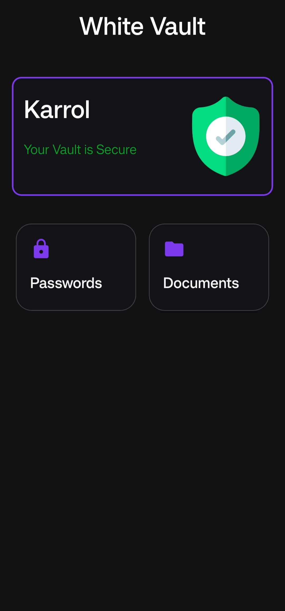
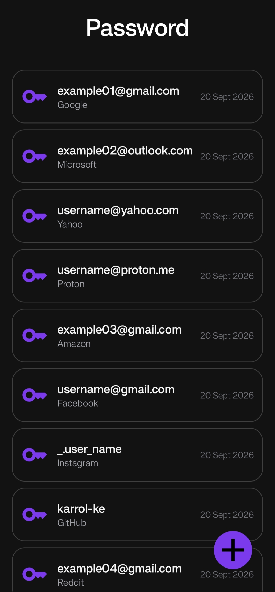
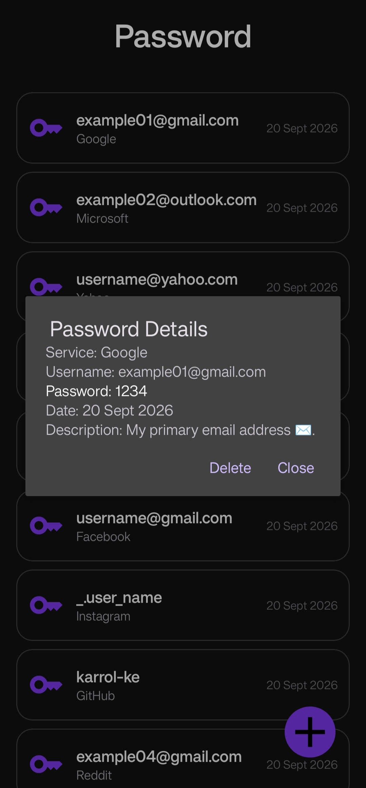
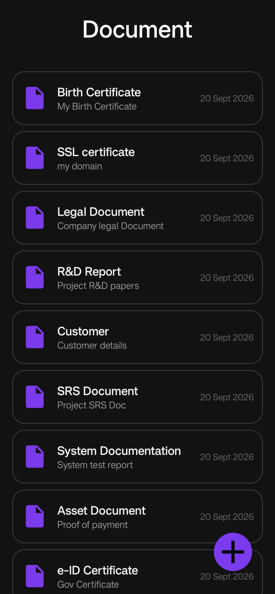
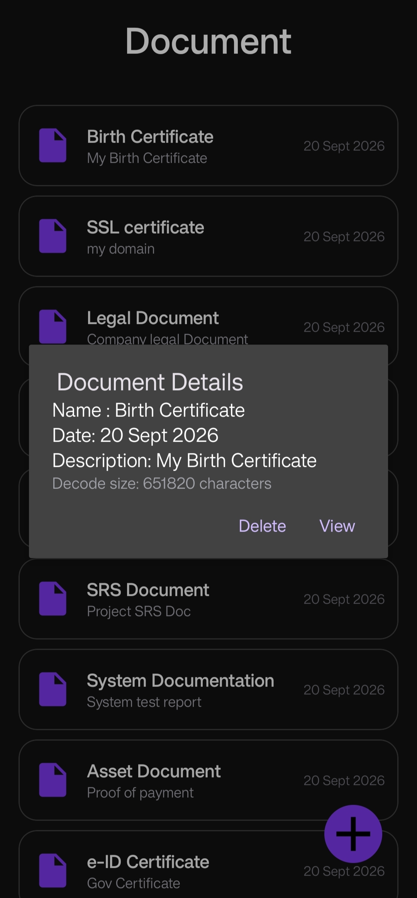
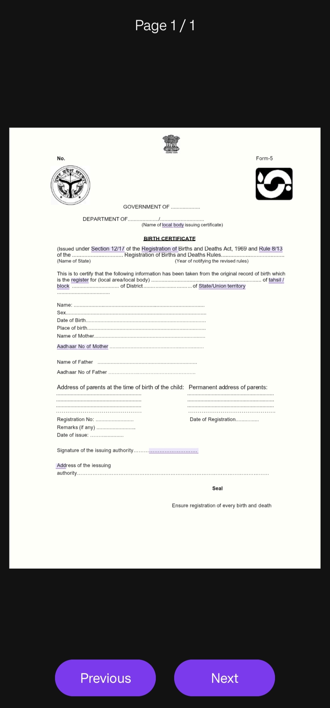

White Vault
===========

The White Vault is an android application platform designed to securely store passwords and identity documents. It acts as an encrypted virtual vault. Instead of carrying ID's and passwords, users store digitized versions of their documents and passwords on their android device.

For Users
=========

Get Started
~~~~~~~~~~~
* Download and install the latest version of the application from the "Releases" section of the repository.
* Enter a "Username" and "Password" to create your secure database.
* Authenticate using your "Password" to unlock and access the database.
* Store your documents in the "Documents" section and your credentials in the "Passwords" section.
* Access your private documents and passwords whenever you need them.

Features
~~~~~~~~
1. Password Locker
    - Store username/email.
    - Store password.
    - Search saved credentials.
    
2. Document Locker
    - Organize documents into categories.
    - View and delete documents.
    - Add document descriptions.
    - Protect documents from unauthorized access.

3. Security
    - PIN/password authentication.
    - Encrypt sensitive stored data.
    

Images
~~~~~~

  
  
  
  
  
  

    

Security Notice
~~~~~~~~~~~~~~~
This application is designed to protect sensitive information. Users should:

* Keep their authentication credentials private.
* Never share passwords or sensitive information stored in the vault.
* Keep the application updated when new security improvements are released.

**Important**
~~~~~~~~~~~
This project is intended for educational and development purposes. Users should verify the application's security before relying on it for highly sensitive or critical information.

    
    
For Contributors
================

Project Information
~~~~~~~~~~~~~~~~~~~
- Platform: Android
- Language: Java
- IDE: Android Studio
- Architecture: MVVM
- Database: Room / SQLite
- Build System: Gradle

Dependencies
~~~~~~~~~~~~

        dependencies {
            implementation("androidx.documentfile:documentfile:1.0.1")
            implementation("androidx.room:room-runtime:2.7.2")
            annotationProcessor("androidx.room:room-compiler:2.7.2")
            implementation("net.zetetic:sqlcipher-android:4.17.0")
            implementation("androidx.sqlite:sqlite:2.7.0")
            implementation("com.google.android.material:material:1.13.0")
        }

        
Development Guidelines
~~~~~~~~~~~~~~~~~~~~~~
- Follow the existing project structure.
- Keep code modular and readable.
- Use meaningful class, method, and variable names.
- Test changes before submitting them.
- Avoid unnecessary dependencies.
- Update documentation when adding new functionality.

Security Guidelines
~~~~~~~~~~~~~~~~~~~
- Never commit passwords or personal information.
- Never commit database keys, API keys, or encryption keys.
- Do not include real user data.
- Do not disable security mechanisms for testing without documenting the reason.

Project Documentation
=====================

-> [View Documentation](docs/document.md)
